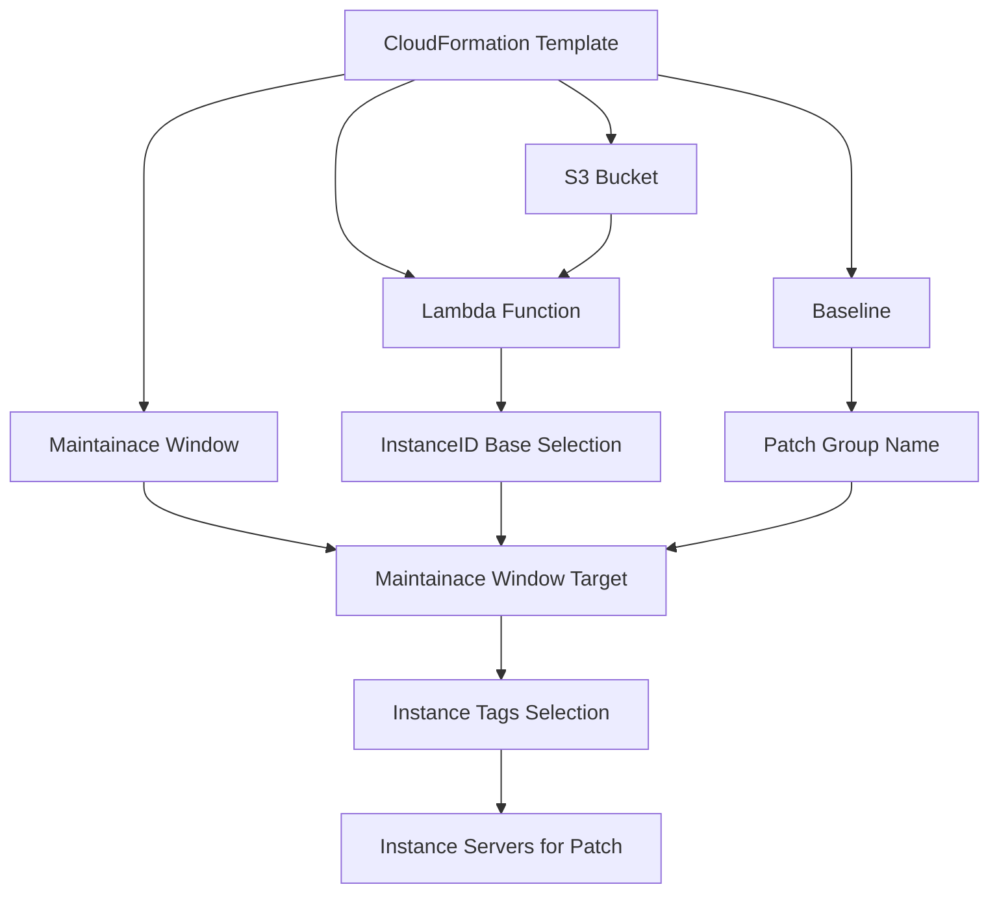

# Patch Management System using AWS CloudFormation and Lambda
### Overview
This repository contains a CloudFormation template designed to manage patch compliance on EC2 instances using AWS Systems Manager Patch Manager. The solution separates the patching process into two distinct types of stacks:

1. Patch Scanning Stack - Scans instances for missing patches.
2. Patch Installation Stack - Installs patches on instances during maintenance windows.

This system uses a tag-based instance selection mechanism, allowing for targeted patch scanning and installation. Additionally, a Lambda function dynamically updates the instance target and the patch baseline by excluding specific patches for certain instances. The Lambda function is triggered via an S3 bucket event, which listens for changes in a designated S3 bucket.

###Features

1. Tag-based Instance Selection: Instances are selected for patching based on predefined tags, allowing for flexible management across environments.
2. Patch Scanning and Installation: Separate tasks are created for scanning and installing patches in different maintenance windows.
3. Dynamic Patch Baseline Update: A Lambda function updates the instance target and patch baseline to exclude certain patches from specific instances.
4. Event-Driven Workflow: S3 bucket events trigger the Lambda function to handle updates dynamically, enabling responsive and automated patch management.

## Architecture

